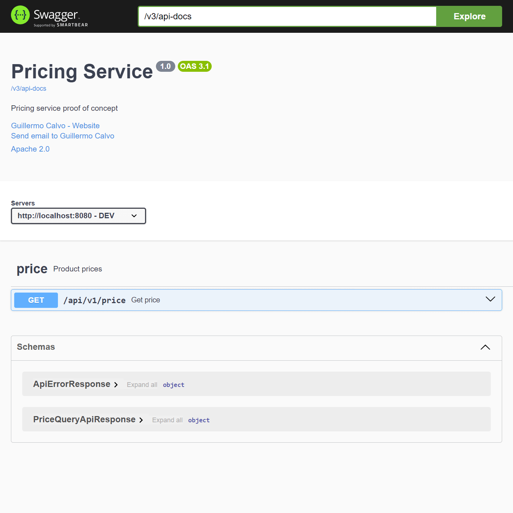

[![Build Status][BADGE_BUILD_STATUS]][BUILD_STATUS]
[![Quality Gate Status][BADGE_QUALITY_GATE]][QUALITY_GATE]
[![Coverage][BADGE_CODE_COVERAGE]][CODE_COVERAGE]
[![Gradle][BADGE_GRADLE]][GRADLE]
[![Spring Boot][BADGE_SPRING_BOOT]][SPRING_BOOT]


# Pricing Service PoC

A domain-driven, hexagonal architecture example that exposes a product pricing service through a REST API powered by:

- [Java](https://www.oracle.com/java/)
- [Spring Boot][SPRING_BOOT]
- [Jakarta Validation API](https://beanvalidation.org/)
- [Jakarta Persistence API](https://jakarta.ee/specifications/persistence/3.2/)
- [Springdoc OpenAPI](https://springdoc.org/)
- [Swagger Annotations](https://swagger.io/)
- [Spring Data JPA](https://spring.io/projects/spring-data-jpa)
- [H2 Database Engine](https://www.h2database.com/)
- [Lombok](https://projectlombok.org/)
- [MapStruct](https://mapstruct.org/)
- [JUnit](https://junit.org/)
- [AssertJ](https://assertj.github.io/)
- [Mockito](https://site.mockito.org/)
- [Gradle][GRADLE]

> [!NOTE]
> The **hexagonal architecture** is an architectural pattern that aims at creating loosely coupled application
> components that can be easily connected to their software environment by means of *ports* and *adapters*.
> This makes components exchangeable at any level and facilitates test automation.

## Project structure

This project is organized as a multi-module [Gradle][GRADLE] build:

- **pricing-domain**: Pure domain model; independent of frameworks and external concerns.
- **pricing-application**: Application service that orchestrates domain logic; defines ports.
- **pricing-persistence-jpa**: Adapter that implements the "persistence" port using JPA repositories.
- **pricing-query-rest**: Adapter that exposes the "query" port as REST endpoints to the outside world.
- **pricing-bootstrap**: Application startup and configuration; wires up all modules, configures Spring Boot, DI, etc.


## Getting Started

Build and run the application.

```shell
./gradlew bootRun
```

This will start a stand-alone server on port 8080.


## Running the Service

Once started, you can interact with the API.

```shell
curl -s 'http://localhost:8080/api/v1/price/1/35455/2020-07-07T12:30:00Z'
```

You should see a JSON response like this:

```json
{
  "brandId": 1,
  "productId": 35455,
  "priceListId": 4,
  "startDate": "2020-06-15T16:00:00Z",
  "endDate": "2020-12-31T23:59:59Z",
  "price": 38.95,
  "currency": "EUR"
}
```


## Using Swagger-UI

OpenAPI docs are auto-generated at runtime via SpringDoc.

You can navigate to <http://localhost:8080/> to inspect the API using an interactive UI.




## Testing

Unit and integration tests are included. Coverage metrics are collected via JaCoCo.

```shell
./gradlew check
```

This will generate an aggregated code coverage report in **pricing-bootstrap**.


## Author

Copyright 2025 [Guillermo Calvo][AUTHOR].

[![][GUILLERMO_IMAGE]][GUILLERMO]


[AUTHOR]:                       https://github.com/guillermocalvo/
[BADGE_BUILD_STATUS]:           https://github.com/guillermocalvo/pricing-service-poc/workflows/Build/badge.svg
[BADGE_CODE_COVERAGE]:          https://sonarcloud.io/api/project_badges/measure?project=guillermocalvo_pricing-service-poc&metric=coverage
[BADGE_GRADLE]:                 https://img.shields.io/badge/Gradle-1FAEC9?logo=Gradle&logoColor=white
[BADGE_QUALITY_GATE]:           https://sonarcloud.io/api/project_badges/measure?project=guillermocalvo_pricing-service-poc&metric=alert_status
[BADGE_SPRING_BOOT]:            https://img.shields.io/badge/Spring%20Boot-6DB33F?logo=Spring&logoColor=white
[BUILD_STATUS]:                 https://github.com/guillermocalvo/pricing-service-poc/actions?query=workflow%3ABuild
[CODE_COVERAGE]:                https://sonarcloud.io/component_measures?id=guillermocalvo_pricing-service-poc&metric=coverage&view=list
[GRADLE]:                       https://gradle.org/
[GUILLERMO]:                    https://guillermo.dev/
[GUILLERMO_IMAGE]:              https://guillermo.dev/assets/images/thumb.png
[QUALITY_GATE]:                 https://sonarcloud.io/dashboard?id=guillermocalvo_pricing-service-poc
[SPRING_BOOT]:                  https://spring.io/projects/spring-boot
